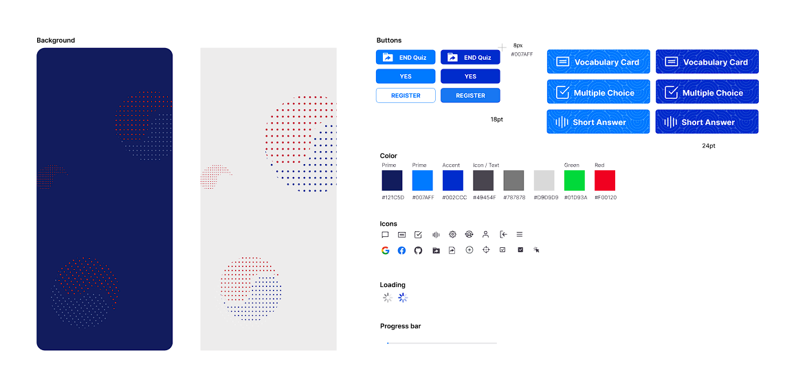
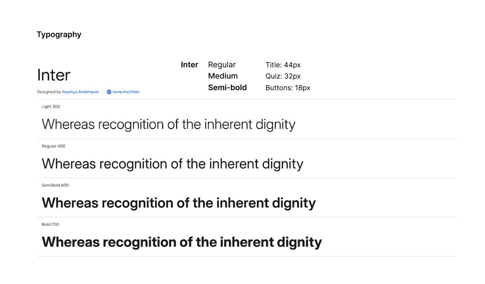
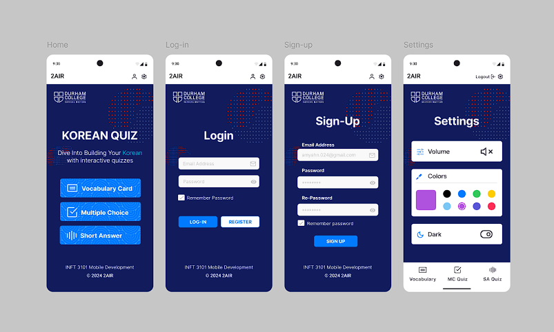
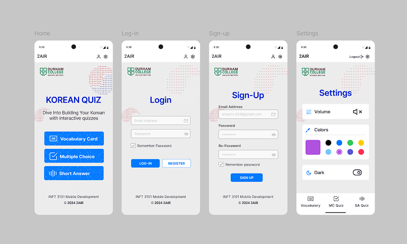
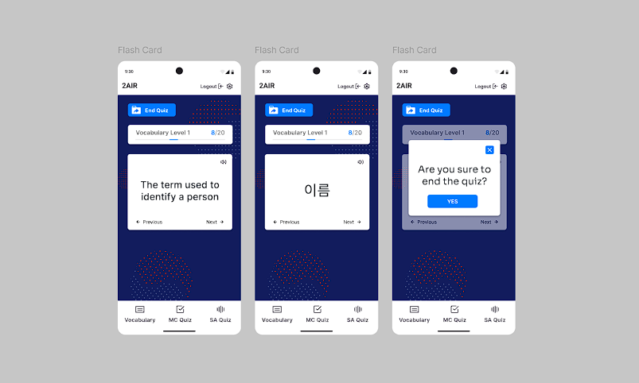
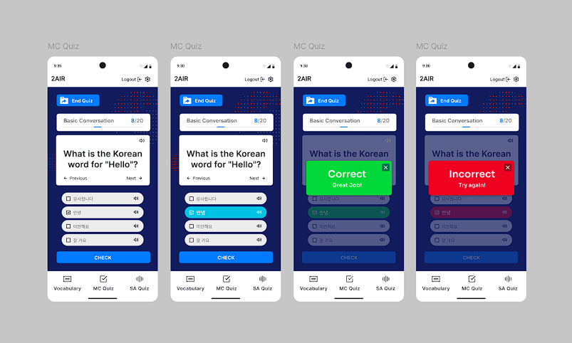
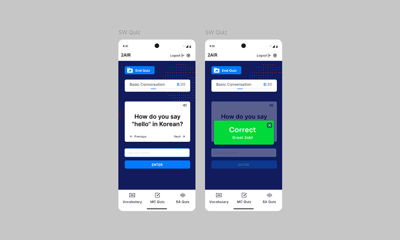
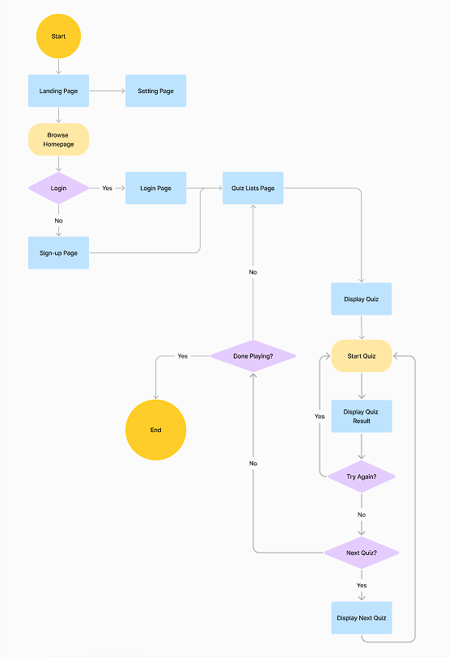

# 2AIR Korean Quiz App

This app, 2AIR Korean Quiz, is a Flutter-based Android application designed to help users improve their Korean language skills through engaging quizzes.

### Work Period: 2024. 11. 13 - 12. 4

# Purpose

The purpose of developing a language learning app is based on my experience teaching Korean. I found that incorporating quiz apps like Kahoot as study tools was highly effective in engaging and motivating my students. This inspired me to create a dedicated app that offers fun and stimulating features for learning, such as media interactions and quiz activities. Through this app, students will be able to enjoy learning while I can collect real user feedback. Additionally, by publishing it on Google, the app can reach a wider audience who may find it beneficial for their language learning journey.

<!--  -->

## Figma Prototype

> https://www.figma.com/proto/IrQjHpSKg7NaCX2TsRE53t/2AIR--Korean-Quiz?node-id=0-6441&node-type=canvas&t=RJJUR4jCzgATOW63-1&scaling=min-zoom&content-scaling=fixed&page-id=0%3A1&starting-point-node-id=0%3A6441

## App design

## Features

- **Multiple Quiz Modes**: The app offers various quiz types, including vocabulary flash card, multiple-choice and short-answer questions.
- **Interactive and Modular Design**:
  - Components like buttons, cards, progress bars, and answer fields are modularized for reusability, ensuring a consistent and polished design throughout the app.
  - Users are provided with feedback on their answers through dynamic answer modals.
- **Responsive Design**:
  - The app is optimized for devices of all sizes using responsive utilities, ensuring a smooth user experience on different screen resolutions.
- **Customizable and Themed Interface**:
  - Questions are loaded dynamically from a JSON file, allowing easy updates and scalability of quiz content.
- **Data-Driven Functionality**: Users can book hotels, and their reservations are saved in their profile under "upcoming reservations."
- **User Progress Tracking**: Users can track their progress through a progress bar that displays the number of completed and remaining questions.
- **Session Management and Scoring**:
  - The app incorporates session management to personalize the user experience.
  - Logged-in users can track their scores, which are stored and updated dynamically.
- **Loading State and Error Handling**:
  - A loading indicator ensures the app provides visual feedback while questions are being fetched.
  - Error handling ensures smooth functionality even in case of unexpected inputs or issues.

## User Flow

## Technologies

- **Frontend**:
  - Dart, Flutter.
- **APIs**: Json.
- **Data Fetching and Caching**:
- **UI Components**: Flutter Widgets.

## Getting Started with Korean Quiz

This project is a starting point for a Flutter application.

A few resources to get you started if this is your first Flutter project:

- [Lab: Write your first Flutter app](https://docs.flutter.dev/get-started/codelab)
- [Cookbook: Useful Flutter samples](https://docs.flutter.dev/cookbook)

For help getting started with Flutter development, view the
[online documentation](https://docs.flutter.dev/), which offers tutorials,
samples, guidance on mobile development, and a full API reference.

## How It Works

- **Login**:
- **Sign-up**:
- **Setting**:
- **Flash Card**:
- **Multiple Choice**:
- **Short Answer**:

## Future Improvements

- **Complete responsive design**: Due to time constraints during the 3-week project timeline, the app's responsive design and theme integration remain incomplete. Future updates will focus on enhancing the user interface for better adaptability across devices.

- **Integrating MongoDB**: Currently, the app uses a JSON file to store questions and data, which limits its scalability. Implementing MongoDB will enable dynamic storage and retrieval of user progress and quiz data, allowing the app to scale effectively.
- **Provide various quiz level**: With database improvements, the app aims to introduce quizzes tailored to different difficulty levels and topics, providing a richer and more personalized learning experience for users.
